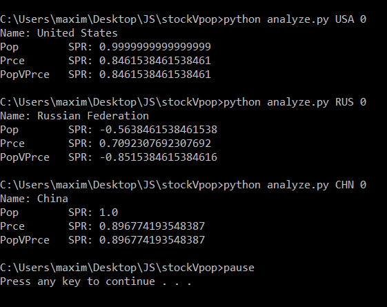

# Stock Vs Pop

This project was to test the hypothesis that when the population went up the market index would go up. 

#### Process

I started by collecting historical market data from [investing.com](https://investing.com). Then, I downloaded [the worldbank's population dataset](https://data.worldbank.org/indicator/SP.POP.TOTL). After, I wrote a python script to compare three things: population vs time (Pop), market index price vs time (Prce), and population vs market index price (PopVPrce). I used Spearman's rank-order correlation to calculate the correlation values since linear regression gave differences in correlation that were most likely irrelevant, in addition markets and populations aren't linear. 

*Note: the linear correlation produced the same results except overemphasizing population vs market index correlation in China.*

#### Results

#### 

The first thing to note is for both China and the United States, the price vs time and population vs price have the same Spearman's rank-order correlation. This is because the population vs time correlations are one which means that in those cases the population is just a monotonic mapping for time, hence why price vs time and population (a monotonic mapping of time) vs price are the same. The outlier in this case is Russia, population vs price is a better indicator of the market index than just time. Another interesting thing to note is that Russia is the only country out of the three that has a negative correlation between population and stock market index. **I suspect that population is not a good indicator of the market but from the limited amount of countries I examined it seems to prove that population is either as good or better than time to predict market index movements.** 

